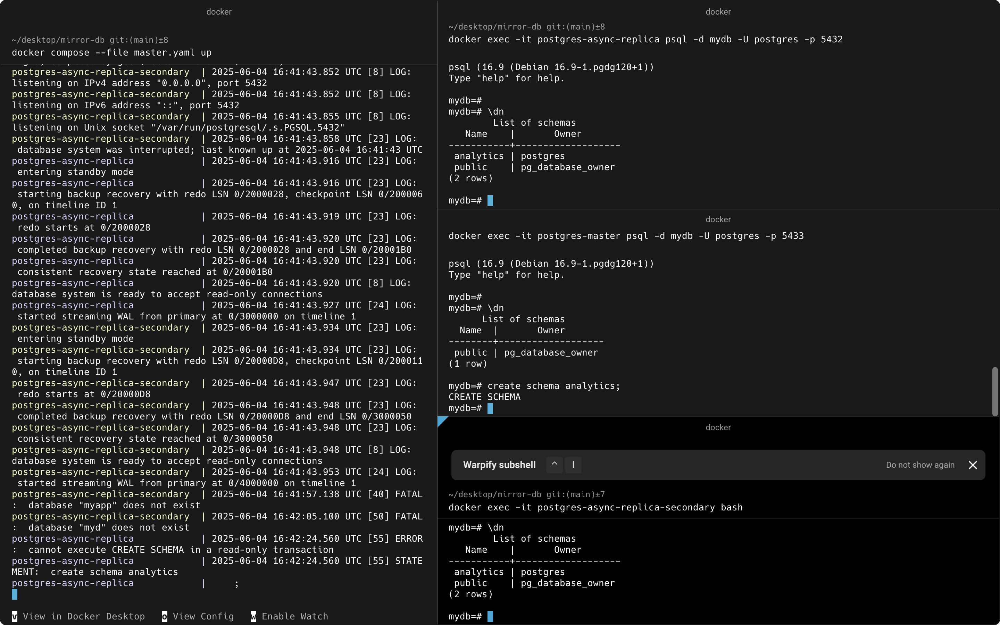

<h1 align="center">Mirror-DB</h1>

Week 1: Setup pg_auto_failover cluster with Docker Compose
Day 1-2:

Clone the pg_auto_failover GitHub repo and navigate to the tutorial directory:

text
git clone https://github.com/hapostgres/pg_auto_failover
cd pg_auto_failover/docs/tutorial
Build the Docker images locally:

text
docker compose build
Review the provided docker-compose.yml which defines monitor, node1, node2, and node3 services.

Day 3-4:

Start the cluster:

text
docker compose up
This will start the monitor and three Postgres nodes (one primary, two standbys).

Verify cluster status using pg_autoctl show state inside containers.

Day 5:

Simulate failover by stopping the primary node container and observe automatic promotion of a standby.

Restart the old primary and verify it rejoins as standby.

Day 6-7:

Explore and tweak replication settings, failover timeouts, and authentication options in the docker-compose.yml.

Experiment with connecting an application container or local psql client to the cluster.

Week 2: Add HAProxy load balancing and polish setup
Day 8-9:

Add an HAProxy container to the Docker Compose setup.

Configure HAProxy to route write traffic to the primary node and optionally distribute read traffic to standbys.

Use health checks (pg_isready or PostgreSQL protocol checks) in HAProxy config.

Day 10-11:

Test client failover by connecting through HAProxy and simulating primary node failure.

Verify HAProxy routes traffic automatically to the new primary.

Day 12-13:

Add logging and monitoring containers (optional) such as pg_stat_monitor or Prometheus exporters.

Document your setup and commands for starting, stopping, and troubleshooting.

Day 14:

Clean up and finalize your Docker Compose files.

Prepare for potential future migration to Docker Swarm or multi-host environments.